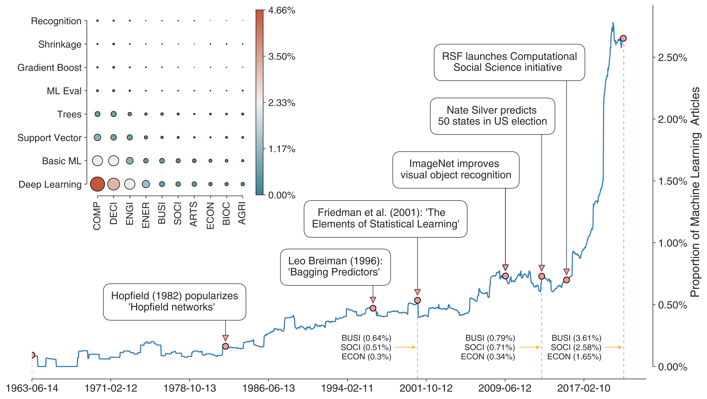

## :bar_chart: A quintessential case of Amara’s Law?  :chart_with_upwards_trend:

---

A short bit of code to accompany the commentary entitled: "Machine Learning in the Academic Social Sciences: a quintessential case of Amara’s Law?" with [Mark Verhagen](https://github.com/MarkDVerhagen). Part of a larger strand of work entitled 'The Evolution of Science' all made possible through the [Scopus API](https://dev.elsevier.com/sc_apis.html).
